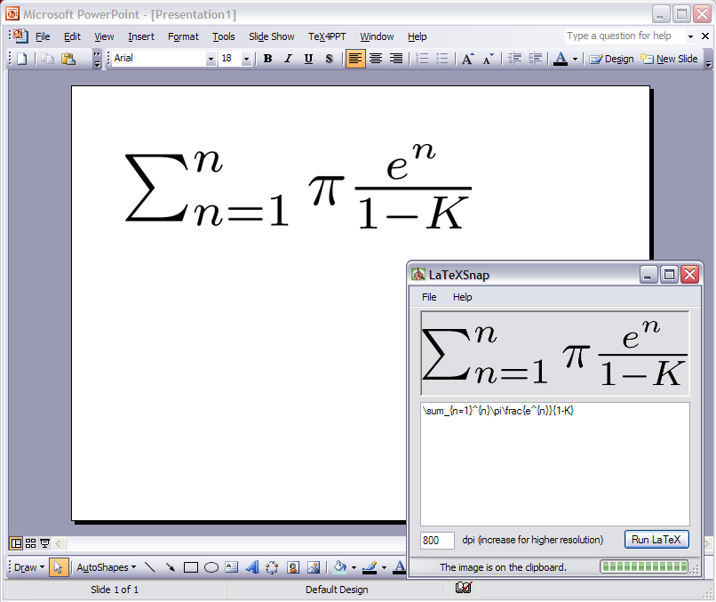

What is LaTeXSnap
=================
LaTeXSnap is a free, open-source, Windows application that renders LaTeX equations as PNG images so they are ready to use in Windows applications, such as Microsoft PowerPoint.

Requirements
------------

  * Microsoft Windows XP or Vista
  * <a href="http://mixtex.org/">MiKTeX</a>
  * The MiKTeX bin folder in your PATH. This should be done automatically by the MiKTeX setup program. (You can check this by running dvipng in a Command Prompt. You should see a listing of options for this command. If, instead, you see dvipng is not recognized as an internal or external command, then you need to add the MiKTeX bin folder to your path).
  * .NET Framework 3.5

Usage
-----
  * Enter an equation.
  * Select a resolution (300 dpi is the default).
  * Click **Run LaTeX**.
  * Go to PowerPoint (or Word) and click Edit -> Paste
  
